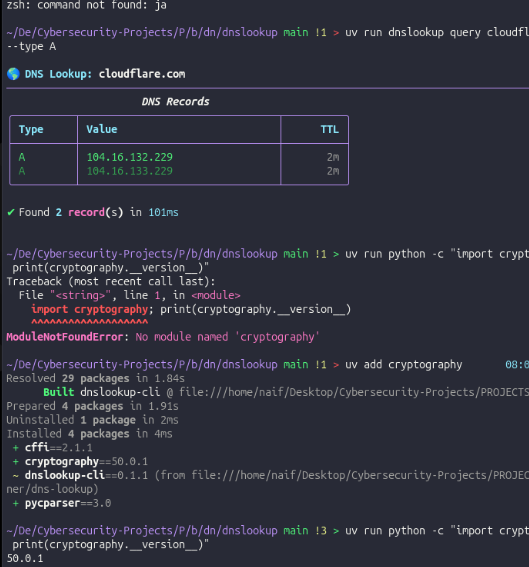
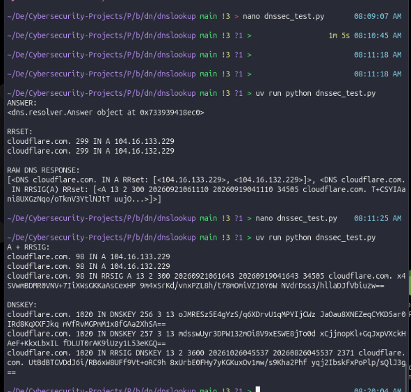
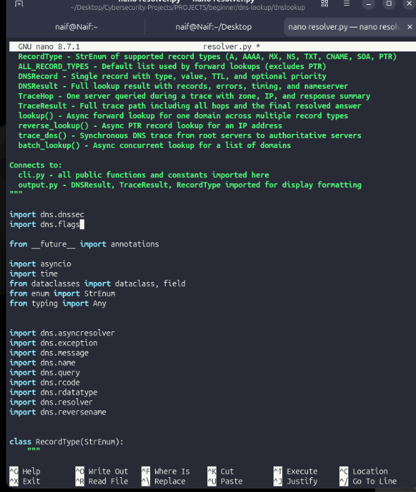
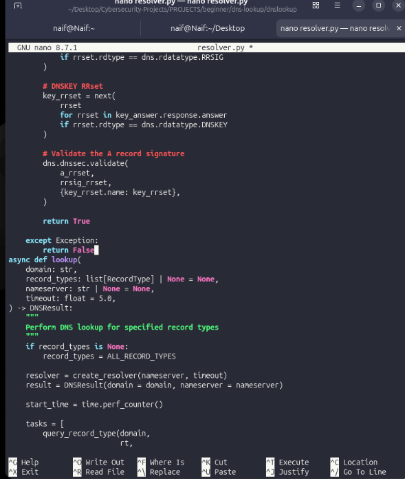
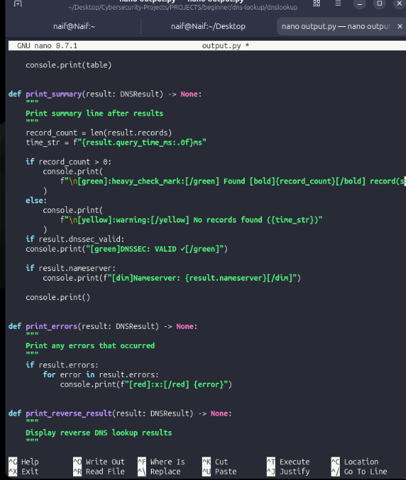
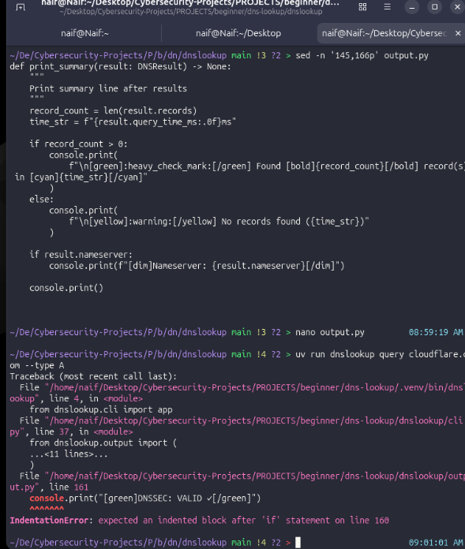

**1. Introduction**

For Challenge 1, I worked on adding DNSSEC validation to the DNS lookup project. The main idea was to make the tool do more than just retrieve DNS records. I wanted it to also check whether the DNS information it received had a valid cryptographic signature.

This was useful for me because DNS is normally just used to translate domain names into IP addresses, but DNSSEC adds a way to verify the authenticity and integrity of signed DNS data. This is also related to cybersecurity because forged DNS responses can be used in attacks such as DNS spoofing and cache poisoning.

**2. Challenge Objective**

The main objectives of Challenge 1 were:

Enable DNSSEC in the DNS resolver.

Request DNSSEC information such as RRSIG and DNSKEY.

Validate a DNS record using its digital signature.

Understand the DS-to-DNSKEY chain of trust.

Integrate DNSSEC validation into the actual project.

Display the validation result to the user.

**3. DNSSEC Concepts I Learned** 

**RRSIG:**

RRSIG contains the digital signature for a DNS record set. For example, an A record can have an RRSIG that can be checked to make sure the response was signed correctly.

**DNSKEY:**

DNSKEY contains the public keys used for DNSSEC verification. I used the DNSKEY returned by the DNS server to test whether the RRSIG signature on the A record was valid.

**DS:** 

DS (Delegation Signer) connects the child domain's DNSKEY to its parent domain. This is important for the DNSSEC chain of trust because it helps establish that the DNSKEY being used is actually trusted.

**DO Flag:**

The DNSSEC OK (DO) flag tells the DNS resolver that I want DNSSEC records included in the response.

**4. Enabling DNSSEC in the Resolver**

The main file I changed was dnslookup/resolver.py. The project already had a create_resolver() function. I configured the resolver to request DNSSEC records using EDNS and the DO flag.

resolver = dns.asyncresolver.Resolver()  
resolver.use_edns(0, dns.flags.DO, 4096)

I had to make sure that the resolver object was created first and then configured. This was one of the small mistakes I corrected while doing the challenge.

**5. Installing the Required Cryptography Package** 

When I first tested the cryptography functionality, the project did not have the cryptography package installed. I checked it and received a ModuleNotFoundError. Since the project uses uv, I installed the package using:

**uv add cryptography** 

After installing it, I checked the installed version and confirmed that cryptography 50.0.1 was available. I also confirmed that the dnspython DNSSEC module was available.

**6. Testing the Raw DNSSEC Response** 

Before changing the whole project, I created a temporary DNSSEC test so I could see what the DNS server was actually returning. The test showed the normal A records and also showed an RRSIG for the A record. In a later test I also inspected the DNSKEY and RRSIG(DNSKEY) records.

**7. Testing Cryptographic Validation**

After confirming that DNSSEC information was being returned, I used dnspython's dns.dnssec.validate() function. The basic idea was to take the A record, its RRSIG, and the DNSKEY and verify the signature.

dns.dnssec.validate(  
a_rrset,  
rrsig_rrset,  
{key_rrset.name: key_rrset},  
)

The validation test successfully returned a valid result. This showed me that the signature could actually be checked cryptographically instead of only looking at the DNS records.

**8. Testing the DS → DNSKEY Relationship** 

I also tested the DS record separately to understand the chain of trust. I used dig to retrieve the DS record for cloudflare.com and compared its key tag with the DNSKEY key tag. The DS key tag matched the corresponding DNSKEY, which helped me understand how the parent domain can establish a trusted relationship with the child DNSKEY.

dig @1.1.1.1 cloudflare.com DS +dnssec

The important point I learned here was that successfully verifying an RRSIG with a DNSKEY is not exactly the same as proving that the DNSKEY itself is trusted. The DS record is part of that trust chain.

**9. Integrating DNSSEC into the Project** 

After testing the individual pieces, I integrated the feature into the real project. The main changes were made in dnslookup/resolver.py and dnslookup/output.py.

Changes in resolver.py

I imported the DNSSEC modules, added a dnssec_valid field to DNSResult, created a validate_dnssec() helper, and called that helper during lookup().

import dns.dnssec  
import dns.flags

dnssec_valid: bool = False

result.dnssec_valid = await validate_dnssec(domain, resolver)

         **DNSSEC imports added to resolver.py.**   

    The validate_dnssec() function using dns.dnssec.validate().

**10. Changes in output.py**

The validation result needed to be visible when running the program, so I modified output.py. If dnssec_valid is True, the program prints a green DNSSEC validation message.

if result.dnssec_valid:  
console.print("[green]DNSSEC: VALID ✓[/green]")

        output.py updated to display the DNSSEC validation result.

**11. Errors I Faced** 

I faced a few small problems during the implementation. First, I placed the DNSSEC resolver configuration in the wrong place and corrected it so the resolver was created before calling use_edns(). Second, cryptography was not installed, so I added it with uv. Third, I had a few Python indentation errors while integrating the code. For example, output.py initially gave an IndentationError because the line after the if statement was not indented correctly.

         IndentationError encountered while adding the DNSSEC output.

**12. Final Test** 

After fixing the errors, I ran the actual DNS lookup command against cloudflare.com. The program returned the A records and then displayed DNSSEC: VALID ✓. This confirmed that the DNSSEC validation feature was working in the real project

           Final successful test showing DNS records and DNSSEC: VALID ✓.

**13. What I Learned** 

DNSSEC does not encrypt DNS traffic. It mainly provides authenticity and integrity for signed DNS data.

RRSIG is the digital signature used to verify a DNS record set.

DNSKEY provides the public key used during signature verification.

DS helps connect a child domain's DNSKEY to its parent and forms part of the chain of trust.

The DNSSEC OK (DO) flag is needed when requesting DNSSEC information.

dnspython provides DNSSEC functionality through dns.dnssec.

Python indentation is part of the syntax, so even a small indentation mistake can stop the program.

Testing individual pieces before integrating them into the main project made it easier to understand what was happening.

**14. Cybersecurity Relevance** 

From a Blue Team and SOC perspective, DNS is important because attackers can abuse it for spoofing, redirection, reconnaissance, tunneling, command and control. DNSSEC can help defend against forged DNS responses by allowing signed DNS data to be verified. This made the project more security-focused than a normal DNS lookup tool.

**15. Technical Note About the Current Implementation** 

The integrated validate_dnssec() function in the project directly validates the A-record signature against the retrieved DNSKEY. I separately tested the DS → DNSKEY relationship to understand and verify the chain of trust. A fully automatic recursive implementation of the complete DNSSEC chain of trust would require additional work to validate the parent DS and continue through the DNS hierarchy. Therefore, I consider the current implementation to be DNSSEC signature validation with separate chain-of-trust testing, rather than a complete recursive trust-chain validator.

**16. Conclusion** 

Overall, Challenge 1 helped me understand DNSSEC in a practical way. Instead of only learning the definitions of RRSIG, DNSKEY and DS, I actually requested the records, inspected the DNS response, performed cryptographic validation, and integrated the result into the DNS lookup project. The final result showed DNSSEC: VALID ✓, which confirmed that the feature was working for the test domain.
